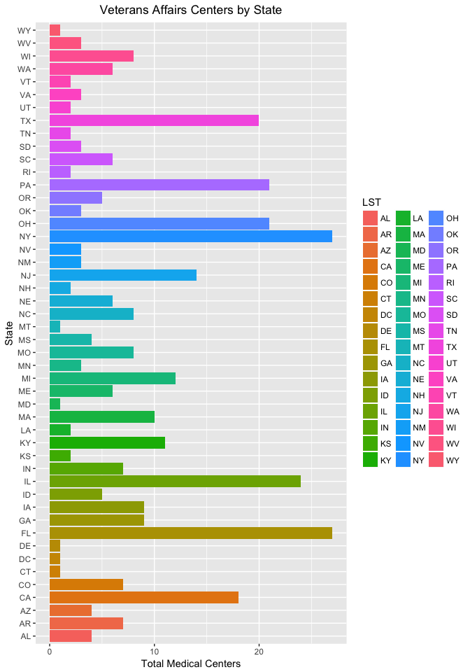
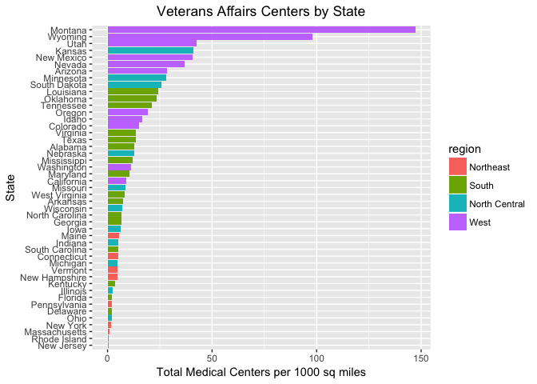

#### Question 1 Mental Helath Clinics (40%)
##### a) Load Data from N-MHSS

```r
load("N-MHSS-2015-DS0001-bndl-data-r/N-MHSS-2015-DS0001-data/N-MHSS-2015-DS0001-data-r.rda")

# Clean White spaces on LST
levels(mh2015_puf$LST) <- trimws(levels(mh2015_puf$LST))

str(mh2015_puf)
```

```
## 'data.frame':	12826 obs. of  139 variables:
##  $ CASEID          : num  2.02e+08 2.02e+08 2.02e+08 2.02e+08 2.02e+08 ...
##  $ LST             : Factor w/ 55 levels "AK","AL","AR",..: 2 2 2 2 2 2 2 2 2 2 ...
##  $ MHINTAKE        : Factor w/ 2 levels "No","Yes": 2 2 2 2 2 2 2 1 2 2 ...
##  $ MHDIAGEVAL      : Factor w/ 2 levels "No","Yes": 2 2 2 2 2 2 2 1 1 2 ...
##  $ MHREFERRAL      : Factor w/ 2 levels "No","Yes": 2 2 2 2 2 2 2 1 2 2 ...
##  $ TREATMT         : Factor w/ 2 levels "No","Yes": 1 1 1 1 1 2 1 1 1 1 ...
##  $ ADMINSERV       : Factor w/ 2 levels "No","Yes": 2 2 1 1 1 2 2 1 1 2 ...
##  $ SETTINGIP       : Factor w/ 2 levels "No","Yes": 2 1 1 1 1 2 2 2 2 2 ...
##  $ SETTINGRC       : Factor w/ 2 levels "No","Yes": 1 1 1 1 1 1 1 1 1 1 ...
##  $ SETTINGDTPH     : Factor w/ 2 levels "No","Yes": 1 1 2 2 1 1 1 2 1 1 ...
##  $ SETTINGOP       : Factor w/ 2 levels "No","Yes": 1 2 1 1 2 2 1 1 1 2 ...
##  $ FACILITYTYPE    : Factor w/ 11 levels "Psychiatric hospital",..: 2 7 7 7 7 2 2 2 2 2 ...
##  $ FOCUS           : Factor w/ 5 levels "Mental health treatment",..: 1 1 1 1 1 1 1 1 1 1 ...
##  $ OWNERSHP        : Factor w/ 3 levels "Private for-profit organization",..: 2 2 3 3 2 2 2 1 1 2 ...
##  $ PUBLICAGENCY    : Factor w/ 8 levels "Logical Skip",..: 1 1 2 2 1 1 1 1 1 1 ...
##  $ TREATPSYCHOTHRPY: Factor w/ 3 levels "Missing","No",..: 3 3 3 3 3 3 3 3 3 3 ...
##  $ TREATFAMTHRPY   : Factor w/ 3 levels "Missing","No",..: 3 2 2 2 2 2 2 2 2 3 ...
##  $ TREATGRPTHRPY   : Factor w/ 3 levels "Missing","No",..: 3 3 3 3 3 3 3 3 2 3 ...
##  $ TREATCOGTHRPY   : Factor w/ 3 levels "Missing","No",..: 3 2 2 2 2 2 2 2 3 3 ...
##  $ TREATDIALTHRPY  : Factor w/ 3 levels "Missing","No",..: 2 2 2 2 2 2 2 3 3 3 ...
##  $ TREATBEHAVMOD   : Factor w/ 3 levels "Missing","No",..: 2 2 2 2 2 2 2 3 3 2 ...
##  $ TREATDUALMHSA   : Factor w/ 3 levels "Missing","No",..: 2 2 2 2 2 2 3 3 2 2 ...
##  $ TREATTRAUMATHRPY: Factor w/ 3 levels "Missing","No",..: 2 2 2 2 2 2 2 2 3 2 ...
##  $ TREATACTVTYTHRPY: Factor w/ 3 levels "Missing","No",..: 3 2 2 2 2 3 3 3 3 3 ...
##  $ TREATELECTRO    : Factor w/ 3 levels "Missing","No",..: 3 2 2 2 2 2 2 3 2 3 ...
##  $ TREATTELEMEDINCE: Factor w/ 3 levels "Missing","No",..: 2 3 3 3 3 2 2 2 3 2 ...
##  $ TREATPSYCHOMED  : Factor w/ 3 levels "Missing","No",..: 3 3 3 3 3 3 3 3 3 3 ...
##  $ TREATOTH        : Factor w/ 3 levels "Missing","No",..: 2 2 2 2 2 2 2 2 2 2 ...
##  $ NOTREAT         : Factor w/ 3 levels "Missing","No",..: 2 2 2 2 2 2 2 2 2 2 ...
##  $ ASSERTCOMM      : Factor w/ 3 levels "Missing","No",..: 2 2 2 2 2 2 2 2 2 2 ...
##  $ MHINTCASEMGMT   : Factor w/ 3 levels "Missing","No",..: 2 2 2 2 2 2 2 2 3 2 ...
##  $ MHCASEMGMT      : Factor w/ 3 levels "Missing","No",..: 2 3 2 2 3 3 3 2 3 3 ...
##  $ MHCOURTORDERED  : num  0 1 0 0 1 0 0 0 0 0 ...
##  $ MHCHRONIC       : Factor w/ 3 levels "Missing","No",..: 2 2 2 2 2 3 3 2 3 2 ...
##  $ ILLNESSMGMT     : Factor w/ 3 levels "Missing","No",..: 2 3 2 3 3 2 2 2 3 2 ...
##  $ PRIMARYCARE     : Factor w/ 3 levels "Missing","No",..: 2 2 2 2 2 2 3 2 3 2 ...
##  $ DIETEXERCOUNSEL : Factor w/ 3 levels "Missing","No",..: 2 2 2 2 2 3 3 2 3 2 ...
##  $ FAMPSYCHED      : Factor w/ 3 levels "Missing","No",..: 2 2 2 2 2 3 3 2 3 2 ...
##  $ MHEDUCATION     : Factor w/ 3 levels "Missing","No",..: 2 2 2 2 2 3 2 2 3 3 ...
##  $ MHHOUSING       : Factor w/ 3 levels "Missing","No",..: 2 2 2 2 2 2 2 2 2 2 ...
##  $ SUPPHOUSING     : Factor w/ 3 levels "Missing","No",..: 2 2 2 2 2 2 2 2 2 2 ...
##  $ MHPSYCHREHAB    : Factor w/ 3 levels "Missing","No",..: 2 2 2 2 2 2 2 2 2 2 ...
##  $ MHVOCREHAB      : Factor w/ 3 levels "Missing","No",..: 2 2 2 2 2 2 2 2 2 2 ...
##  $ SUPPEMPLOY      : Factor w/ 3 levels "Missing","No",..: 2 2 2 2 2 2 2 2 2 2 ...
##  $ FOSTERCARE      : Factor w/ 3 levels "Missing","No",..: 2 2 2 2 2 2 2 2 2 2 ...
##  $ MHLEGAL         : Factor w/ 3 levels "Missing","No",..: 2 2 2 2 2 2 3 2 2 2 ...
##  $ MHEMGCY         : Factor w/ 3 levels "Missing","No",..: 2 2 2 2 2 2 2 2 2 2 ...
##  $ MHSUICIDE       : Factor w/ 3 levels "Missing","No",..: 2 3 2 2 3 2 3 2 3 3 ...
##  $ MHCONSUMER      : Factor w/ 3 levels "Missing","No",..: 2 2 2 2 2 2 2 2 2 2 ...
##  $ MHTOBACCOUSE    : Factor w/ 3 levels "Missing","No",..: 2 2 2 2 2 3 3 2 3 3 ...
##  $ MHTOBACCOCESS   : Factor w/ 3 levels "Missing","No",..: 2 2 2 2 2 3 2 3 3 3 ...
##  $ MHNICOTINEREP   : Factor w/ 3 levels "Missing","No",..: 2 2 2 2 2 3 3 2 3 3 ...
##  $ SMOKINGCESSATION: Factor w/ 3 levels "Missing","No",..: 2 2 2 2 2 2 3 2 2 3 ...
##  $ MHOTH           : Factor w/ 3 levels "Missing","No",..: 2 2 2 2 2 2 2 2 2 2 ...
##  $ MHNOSVCS        : Factor w/ 3 levels "Missing","No",..: 3 2 3 2 2 2 2 2 2 2 ...
##  $ CHILDAD         : Factor w/ 2 levels "No","Yes": 1 2 1 1 2 1 1 1 1 1 ...
##  $ ADOLES          : Factor w/ 2 levels "No","Yes": 1 2 1 1 2 1 1 1 1 1 ...
##  $ YOUNGADULTS     : Factor w/ 2 levels "No","Yes": 2 2 2 2 2 1 1 2 1 2 ...
##  $ ADULT           : Factor w/ 2 levels "No","Yes": 2 2 2 2 2 2 2 2 2 2 ...
##  $ SENIORS         : Factor w/ 2 levels "No","Yes": 2 2 2 2 2 2 2 2 2 2 ...
##  $ SED             : Factor w/ 3 levels "Missing","No",..: 2 3 2 2 3 2 2 2 2 2 ...
##  $ TAYOUNGADULTS   : Factor w/ 3 levels "Missing","No",..: 2 3 2 2 3 2 2 2 2 2 ...
##  $ SPMI            : Factor w/ 3 levels "Missing","No",..: 3 3 3 3 3 2 2 3 3 3 ...
##  $ SRVC63          : Factor w/ 3 levels "Missing","No",..: 3 2 2 2 2 3 3 3 3 3 ...
##  $ ALZHDEMENTIA    : Factor w/ 3 levels "Missing","No",..: 3 2 2 2 2 3 3 2 3 3 ...
##  $ SRVC31          : Factor w/ 3 levels "Missing","No",..: 3 2 2 2 2 2 3 2 3 3 ...
##  $ SPECGRPEATING   : Factor w/ 3 levels "Missing","No",..: 2 2 2 2 2 2 2 2 2 2 ...
##  $ SRVC116         : Factor w/ 3 levels "Missing","No",..: 3 2 2 2 2 2 2 2 3 3 ...
##  $ POSTTRAUM       : Factor w/ 3 levels "Missing","No",..: 3 2 2 2 2 2 2 2 3 3 ...
##  $ TRAUMATICBRAIN  : Factor w/ 3 levels "Missing","No",..: 2 2 2 2 2 2 2 2 3 3 ...
##  $ SRVC113         : Factor w/ 3 levels "Missing","No",..: 2 2 2 2 2 2 2 2 3 3 ...
##  $ SRVC114         : Factor w/ 3 levels "Missing","No",..: 3 2 2 2 2 2 2 2 2 3 ...
##  $ SRVC115         : Factor w/ 3 levels "Missing","No",..: 3 2 2 2 2 2 2 2 2 3 ...
##  $ SRVC62          : Factor w/ 3 levels "Missing","No",..: 2 2 2 2 2 2 2 2 3 3 ...
##  $ SRVC61          : Factor w/ 3 levels "Missing","No",..: 2 2 2 2 2 2 2 2 3 2 ...
##  $ SRVC32          : Factor w/ 3 levels "Missing","No",..: 2 2 2 2 2 2 2 2 3 3 ...
##  $ SRVC35          : Factor w/ 3 levels "Missing","No",..: 2 2 2 2 2 2 2 2 2 2 ...
##  $ NOSPECGRP       : Factor w/ 3 levels "Missing","No",..: 2 2 2 2 2 2 2 2 2 2 ...
##  $ CRISISTEAM2     : Factor w/ 3 levels "Missing","No",..: 2 3 2 2 3 2 2 2 2 2 ...
##  $ HEARIMPAIR      : Factor w/ 3 levels "Missing","No",..: 2 3 3 3 3 2 3 3 3 3 ...
##  $ LANG            : Factor w/ 3 levels "Missing","No",..: 2 2 2 2 2 2 3 3 3 2 ...
##  $ LANGPROV        : Factor w/ 5 levels "Logical skip",..: 1 1 1 1 1 1 5 4 4 1 ...
##  $ LANG16          : Factor w/ 4 levels "Logical skip",..: 1 1 1 1 1 1 4 1 1 1 ...
##  $ LANG_B          : Factor w/ 4 levels "Logical skip",..: 1 1 1 1 1 1 3 1 1 1 ...
##  $ LANG1           : Factor w/ 4 levels "Logical skip",..: 1 1 1 1 1 1 1 1 1 1 ...
##  $ LANG2           : Factor w/ 4 levels "Logical skip",..: 1 1 1 1 1 1 1 1 1 1 ...
##  $ LANG3           : Factor w/ 4 levels "Logical skip",..: 1 1 1 1 1 1 1 1 1 1 ...
##  $ LANG21          : Factor w/ 4 levels "Logical skip",..: 1 1 1 1 1 1 1 1 1 1 ...
##  $ LANG4           : Factor w/ 4 levels "Logical skip",..: 1 1 1 1 1 1 1 1 1 1 ...
##  $ LANG5           : Factor w/ 4 levels "Logical skip",..: 1 1 1 1 1 1 1 1 1 1 ...
##  $ LANG6           : Factor w/ 4 levels "Logical skip",..: 1 1 1 1 1 1 1 1 1 1 ...
##  $ LANG7           : Factor w/ 4 levels "Logical skip",..: 1 1 1 1 1 1 1 1 1 1 ...
##  $ LANG8           : Factor w/ 4 levels "Logical skip",..: 1 1 1 1 1 1 1 1 1 1 ...
##  $ LANG24          : Factor w/ 4 levels "Logical skip",..: 1 1 1 1 1 1 1 1 1 1 ...
##  $ LANG9           : Factor w/ 4 levels "Logical skip",..: 1 1 1 1 1 1 1 1 1 1 ...
##  $ LANG10          : Factor w/ 4 levels "Logical skip",..: 1 1 1 1 1 1 1 1 1 1 ...
##  $ LANG22          : Factor w/ 4 levels "Logical skip",..: 1 1 1 1 1 1 1 1 1 1 ...
##  $ LANG25          : Factor w/ 4 levels "Logical skip",..: 1 1 1 1 1 1 1 1 1 1 ...
##  $ LANG26          : Factor w/ 4 levels "Logical skip",..: 1 1 1 1 1 1 1 1 1 1 ...
##   [list output truncated]
##  - attr(*, "variable.labels")= Named chr  "Case Identification Number" "State abbreviations" "QA1.1 Facility offers mental health intake services" "QA1.2 Facility offers mental health diagnostic evaluation" ...
##   ..- attr(*, "names")= chr  "CASEID" "LST" "MHINTAKE" "MHDIAGEVAL" ...
##  - attr(*, "codepage")= int 65001
```

##### b) Distinct List of States

```r
states <- unique(mh2015_puf$LST)
kable( states,row.names=FALSE )  %>%
  kable_styling(bootstrap_options = c("striped", "condensed"), full_width = F)
```

<table class="table table-striped table-condensed" style="width: auto !important; margin-left: auto; margin-right: auto;">
 <thead>
  <tr>
   <th style="text-align:left;"> x </th>
  </tr>
 </thead>
<tbody>
  <tr>
   <td style="text-align:left;"> AL </td>
  </tr>
  <tr>
   <td style="text-align:left;"> AK </td>
  </tr>
  <tr>
   <td style="text-align:left;"> AZ </td>
  </tr>
  <tr>
   <td style="text-align:left;"> AR </td>
  </tr>
  <tr>
   <td style="text-align:left;"> CA </td>
  </tr>
  <tr>
   <td style="text-align:left;"> CO </td>
  </tr>
  <tr>
   <td style="text-align:left;"> CT </td>
  </tr>
  <tr>
   <td style="text-align:left;"> DE </td>
  </tr>
  <tr>
   <td style="text-align:left;"> DC </td>
  </tr>
  <tr>
   <td style="text-align:left;"> FL </td>
  </tr>
  <tr>
   <td style="text-align:left;"> GA </td>
  </tr>
  <tr>
   <td style="text-align:left;"> HI </td>
  </tr>
  <tr>
   <td style="text-align:left;"> ID </td>
  </tr>
  <tr>
   <td style="text-align:left;"> IL </td>
  </tr>
  <tr>
   <td style="text-align:left;"> IN </td>
  </tr>
  <tr>
   <td style="text-align:left;"> IA </td>
  </tr>
  <tr>
   <td style="text-align:left;"> KS </td>
  </tr>
  <tr>
   <td style="text-align:left;"> KY </td>
  </tr>
  <tr>
   <td style="text-align:left;"> LA </td>
  </tr>
  <tr>
   <td style="text-align:left;"> ME </td>
  </tr>
  <tr>
   <td style="text-align:left;"> MD </td>
  </tr>
  <tr>
   <td style="text-align:left;"> MA </td>
  </tr>
  <tr>
   <td style="text-align:left;"> MI </td>
  </tr>
  <tr>
   <td style="text-align:left;"> MN </td>
  </tr>
  <tr>
   <td style="text-align:left;"> MS </td>
  </tr>
  <tr>
   <td style="text-align:left;"> MO </td>
  </tr>
  <tr>
   <td style="text-align:left;"> MT </td>
  </tr>
  <tr>
   <td style="text-align:left;"> NE </td>
  </tr>
  <tr>
   <td style="text-align:left;"> NV </td>
  </tr>
  <tr>
   <td style="text-align:left;"> NH </td>
  </tr>
  <tr>
   <td style="text-align:left;"> NJ </td>
  </tr>
  <tr>
   <td style="text-align:left;"> NM </td>
  </tr>
  <tr>
   <td style="text-align:left;"> NY </td>
  </tr>
  <tr>
   <td style="text-align:left;"> NC </td>
  </tr>
  <tr>
   <td style="text-align:left;"> ND </td>
  </tr>
  <tr>
   <td style="text-align:left;"> OH </td>
  </tr>
  <tr>
   <td style="text-align:left;"> OK </td>
  </tr>
  <tr>
   <td style="text-align:left;"> OR </td>
  </tr>
  <tr>
   <td style="text-align:left;"> PA </td>
  </tr>
  <tr>
   <td style="text-align:left;"> RI </td>
  </tr>
  <tr>
   <td style="text-align:left;"> SC </td>
  </tr>
  <tr>
   <td style="text-align:left;"> SD </td>
  </tr>
  <tr>
   <td style="text-align:left;"> TN </td>
  </tr>
  <tr>
   <td style="text-align:left;"> TX </td>
  </tr>
  <tr>
   <td style="text-align:left;"> UT </td>
  </tr>
  <tr>
   <td style="text-align:left;"> VT </td>
  </tr>
  <tr>
   <td style="text-align:left;"> VA </td>
  </tr>
  <tr>
   <td style="text-align:left;"> WA </td>
  </tr>
  <tr>
   <td style="text-align:left;"> WV </td>
  </tr>
  <tr>
   <td style="text-align:left;"> WI </td>
  </tr>
  <tr>
   <td style="text-align:left;"> WY </td>
  </tr>
  <tr>
   <td style="text-align:left;"> AS </td>
  </tr>
  <tr>
   <td style="text-align:left;"> GU </td>
  </tr>
  <tr>
   <td style="text-align:left;"> PR </td>
  </tr>
  <tr>
   <td style="text-align:left;"> VI </td>
  </tr>
</tbody>
</table>

##### c) Filter for VAs

```r
va <- mh2015_puf[mh2015_puf$FACILITYTYPE == "Veterans Administration medical center (VAMC) or other VA health care facility",]
va <- va[va$LST != "AK" & va$LST != "HI" & va$LST != "PR" & va$LST != "VI" & va$LST != "AS",c(1,2)]

va.states <- va %>%
    group_by(LST) %>%
    summarize(count = n())
kable( va.states,row.names=FALSE )  %>%
  kable_styling(bootstrap_options = c("striped", "condensed"), full_width = F)
```

<table class="table table-striped table-condensed" style="width: auto !important; margin-left: auto; margin-right: auto;">
 <thead>
  <tr>
   <th style="text-align:left;"> LST </th>
   <th style="text-align:right;"> count </th>
  </tr>
 </thead>
<tbody>
  <tr>
   <td style="text-align:left;"> AL </td>
   <td style="text-align:right;"> 4 </td>
  </tr>
  <tr>
   <td style="text-align:left;"> AR </td>
   <td style="text-align:right;"> 7 </td>
  </tr>
  <tr>
   <td style="text-align:left;"> AZ </td>
   <td style="text-align:right;"> 4 </td>
  </tr>
  <tr>
   <td style="text-align:left;"> CA </td>
   <td style="text-align:right;"> 18 </td>
  </tr>
  <tr>
   <td style="text-align:left;"> CO </td>
   <td style="text-align:right;"> 7 </td>
  </tr>
  <tr>
   <td style="text-align:left;"> CT </td>
   <td style="text-align:right;"> 1 </td>
  </tr>
  <tr>
   <td style="text-align:left;"> DC </td>
   <td style="text-align:right;"> 1 </td>
  </tr>
  <tr>
   <td style="text-align:left;"> DE </td>
   <td style="text-align:right;"> 1 </td>
  </tr>
  <tr>
   <td style="text-align:left;"> FL </td>
   <td style="text-align:right;"> 27 </td>
  </tr>
  <tr>
   <td style="text-align:left;"> GA </td>
   <td style="text-align:right;"> 9 </td>
  </tr>
  <tr>
   <td style="text-align:left;"> IA </td>
   <td style="text-align:right;"> 9 </td>
  </tr>
  <tr>
   <td style="text-align:left;"> ID </td>
   <td style="text-align:right;"> 5 </td>
  </tr>
  <tr>
   <td style="text-align:left;"> IL </td>
   <td style="text-align:right;"> 24 </td>
  </tr>
  <tr>
   <td style="text-align:left;"> IN </td>
   <td style="text-align:right;"> 7 </td>
  </tr>
  <tr>
   <td style="text-align:left;"> KS </td>
   <td style="text-align:right;"> 2 </td>
  </tr>
  <tr>
   <td style="text-align:left;"> KY </td>
   <td style="text-align:right;"> 11 </td>
  </tr>
  <tr>
   <td style="text-align:left;"> LA </td>
   <td style="text-align:right;"> 2 </td>
  </tr>
  <tr>
   <td style="text-align:left;"> MA </td>
   <td style="text-align:right;"> 10 </td>
  </tr>
  <tr>
   <td style="text-align:left;"> MD </td>
   <td style="text-align:right;"> 1 </td>
  </tr>
  <tr>
   <td style="text-align:left;"> ME </td>
   <td style="text-align:right;"> 6 </td>
  </tr>
  <tr>
   <td style="text-align:left;"> MI </td>
   <td style="text-align:right;"> 12 </td>
  </tr>
  <tr>
   <td style="text-align:left;"> MN </td>
   <td style="text-align:right;"> 3 </td>
  </tr>
  <tr>
   <td style="text-align:left;"> MO </td>
   <td style="text-align:right;"> 8 </td>
  </tr>
  <tr>
   <td style="text-align:left;"> MS </td>
   <td style="text-align:right;"> 4 </td>
  </tr>
  <tr>
   <td style="text-align:left;"> MT </td>
   <td style="text-align:right;"> 1 </td>
  </tr>
  <tr>
   <td style="text-align:left;"> NC </td>
   <td style="text-align:right;"> 8 </td>
  </tr>
  <tr>
   <td style="text-align:left;"> NE </td>
   <td style="text-align:right;"> 6 </td>
  </tr>
  <tr>
   <td style="text-align:left;"> NH </td>
   <td style="text-align:right;"> 2 </td>
  </tr>
  <tr>
   <td style="text-align:left;"> NJ </td>
   <td style="text-align:right;"> 14 </td>
  </tr>
  <tr>
   <td style="text-align:left;"> NM </td>
   <td style="text-align:right;"> 3 </td>
  </tr>
  <tr>
   <td style="text-align:left;"> NV </td>
   <td style="text-align:right;"> 3 </td>
  </tr>
  <tr>
   <td style="text-align:left;"> NY </td>
   <td style="text-align:right;"> 27 </td>
  </tr>
  <tr>
   <td style="text-align:left;"> OH </td>
   <td style="text-align:right;"> 21 </td>
  </tr>
  <tr>
   <td style="text-align:left;"> OK </td>
   <td style="text-align:right;"> 3 </td>
  </tr>
  <tr>
   <td style="text-align:left;"> OR </td>
   <td style="text-align:right;"> 5 </td>
  </tr>
  <tr>
   <td style="text-align:left;"> PA </td>
   <td style="text-align:right;"> 21 </td>
  </tr>
  <tr>
   <td style="text-align:left;"> RI </td>
   <td style="text-align:right;"> 2 </td>
  </tr>
  <tr>
   <td style="text-align:left;"> SC </td>
   <td style="text-align:right;"> 6 </td>
  </tr>
  <tr>
   <td style="text-align:left;"> SD </td>
   <td style="text-align:right;"> 3 </td>
  </tr>
  <tr>
   <td style="text-align:left;"> TN </td>
   <td style="text-align:right;"> 2 </td>
  </tr>
  <tr>
   <td style="text-align:left;"> TX </td>
   <td style="text-align:right;"> 20 </td>
  </tr>
  <tr>
   <td style="text-align:left;"> UT </td>
   <td style="text-align:right;"> 2 </td>
  </tr>
  <tr>
   <td style="text-align:left;"> VA </td>
   <td style="text-align:right;"> 3 </td>
  </tr>
  <tr>
   <td style="text-align:left;"> VT </td>
   <td style="text-align:right;"> 2 </td>
  </tr>
  <tr>
   <td style="text-align:left;"> WA </td>
   <td style="text-align:right;"> 6 </td>
  </tr>
  <tr>
   <td style="text-align:left;"> WI </td>
   <td style="text-align:right;"> 8 </td>
  </tr>
  <tr>
   <td style="text-align:left;"> WV </td>
   <td style="text-align:right;"> 3 </td>
  </tr>
  <tr>
   <td style="text-align:left;"> WY </td>
   <td style="text-align:right;"> 1 </td>
  </tr>
</tbody>
</table>

##### d) Bar Graph

```r
ggplot( va.states , aes( LST, count, fill = LST ) ) +
    geom_bar(stat="identity") +
    labs(title="Veterans Affairs Centers by State",y ="Total Medical Centers", x = "State") +
    coord_flip() +
    theme(plot.title = element_text(hjust = 0.5))
```

<!-- -->

#### 2) Cleaning and Bringing in New Features (60%)
##### a)  Bring in Area

```r
s <- data.frame(abb = state.abb, area = state.area, region = state.region, name = state.name)
va.states <- merge(va.states, s, by.x="LST",by.y="abb", all.x=TRUE)
kable(head( va.states ),row.names=FALSE )  %>%
  kable_styling(bootstrap_options = c("striped", "condensed"), full_width = F)
```

<table class="table table-striped table-condensed" style="width: auto !important; margin-left: auto; margin-right: auto;">
 <thead>
  <tr>
   <th style="text-align:left;"> LST </th>
   <th style="text-align:right;"> count </th>
   <th style="text-align:right;"> area </th>
   <th style="text-align:left;"> region </th>
   <th style="text-align:left;"> name </th>
  </tr>
 </thead>
<tbody>
  <tr>
   <td style="text-align:left;"> AL </td>
   <td style="text-align:right;"> 4 </td>
   <td style="text-align:right;"> 51609 </td>
   <td style="text-align:left;"> South </td>
   <td style="text-align:left;"> Alabama </td>
  </tr>
  <tr>
   <td style="text-align:left;"> AR </td>
   <td style="text-align:right;"> 7 </td>
   <td style="text-align:right;"> 53104 </td>
   <td style="text-align:left;"> South </td>
   <td style="text-align:left;"> Arkansas </td>
  </tr>
  <tr>
   <td style="text-align:left;"> AZ </td>
   <td style="text-align:right;"> 4 </td>
   <td style="text-align:right;"> 113909 </td>
   <td style="text-align:left;"> West </td>
   <td style="text-align:left;"> Arizona </td>
  </tr>
  <tr>
   <td style="text-align:left;"> CA </td>
   <td style="text-align:right;"> 18 </td>
   <td style="text-align:right;"> 158693 </td>
   <td style="text-align:left;"> West </td>
   <td style="text-align:left;"> California </td>
  </tr>
  <tr>
   <td style="text-align:left;"> CO </td>
   <td style="text-align:right;"> 7 </td>
   <td style="text-align:right;"> 104247 </td>
   <td style="text-align:left;"> West </td>
   <td style="text-align:left;"> Colorado </td>
  </tr>
  <tr>
   <td style="text-align:left;"> CT </td>
   <td style="text-align:right;"> 1 </td>
   <td style="text-align:right;"> 5009 </td>
   <td style="text-align:left;"> Northeast </td>
   <td style="text-align:left;"> Connecticut </td>
  </tr>
</tbody>
</table>

All states match with the exception of DC.  This is because I used the states.abb table and not include District of Columbia.  The join also works because I did a tidy data initially to remove white spaces on LST to help filter.

##### b) Correction
No correction required, we will not report square miles of DC.

##### c) Calcualte per 1000 sq miles

```r
va.states$per_sq_mile <-  va.states$area / va.states$count / 1000
kable(head( va.states ),row.names=FALSE )  %>%
  kable_styling(bootstrap_options = c("striped", "condensed"), full_width = F)
```

<table class="table table-striped table-condensed" style="width: auto !important; margin-left: auto; margin-right: auto;">
 <thead>
  <tr>
   <th style="text-align:left;"> LST </th>
   <th style="text-align:right;"> count </th>
   <th style="text-align:right;"> area </th>
   <th style="text-align:left;"> region </th>
   <th style="text-align:left;"> name </th>
   <th style="text-align:right;"> per_sq_mile </th>
  </tr>
 </thead>
<tbody>
  <tr>
   <td style="text-align:left;"> AL </td>
   <td style="text-align:right;"> 4 </td>
   <td style="text-align:right;"> 51609 </td>
   <td style="text-align:left;"> South </td>
   <td style="text-align:left;"> Alabama </td>
   <td style="text-align:right;"> 12.902250 </td>
  </tr>
  <tr>
   <td style="text-align:left;"> AR </td>
   <td style="text-align:right;"> 7 </td>
   <td style="text-align:right;"> 53104 </td>
   <td style="text-align:left;"> South </td>
   <td style="text-align:left;"> Arkansas </td>
   <td style="text-align:right;"> 7.586286 </td>
  </tr>
  <tr>
   <td style="text-align:left;"> AZ </td>
   <td style="text-align:right;"> 4 </td>
   <td style="text-align:right;"> 113909 </td>
   <td style="text-align:left;"> West </td>
   <td style="text-align:left;"> Arizona </td>
   <td style="text-align:right;"> 28.477250 </td>
  </tr>
  <tr>
   <td style="text-align:left;"> CA </td>
   <td style="text-align:right;"> 18 </td>
   <td style="text-align:right;"> 158693 </td>
   <td style="text-align:left;"> West </td>
   <td style="text-align:left;"> California </td>
   <td style="text-align:right;"> 8.816278 </td>
  </tr>
  <tr>
   <td style="text-align:left;"> CO </td>
   <td style="text-align:right;"> 7 </td>
   <td style="text-align:right;"> 104247 </td>
   <td style="text-align:left;"> West </td>
   <td style="text-align:left;"> Colorado </td>
   <td style="text-align:right;"> 14.892429 </td>
  </tr>
  <tr>
   <td style="text-align:left;"> CT </td>
   <td style="text-align:right;"> 1 </td>
   <td style="text-align:right;"> 5009 </td>
   <td style="text-align:left;"> Northeast </td>
   <td style="text-align:left;"> Connecticut </td>
   <td style="text-align:right;"> 5.009000 </td>
  </tr>
</tbody>
</table>

##### d) Bar Chart

```r
ggplot( va.states[!is.na(va.states$per_sq_mile),]  , aes( x = reorder(name, per_sq_mile ), per_sq_mile, fill = region ) ) +
    geom_bar(stat="identity") +
    labs(title="Veterans Affairs Centers by State",y ="Total Medical Centers per 1000 sq miles", x = "State") +
    coord_flip() +
    theme(plot.title = element_text(hjust = 0.5))
```

<!-- -->

##### e) Analysis
The West Region has the highest VA medical centers per 1000 sq miles.  While the Northeast has the least.  Before making a decision, we need to include population to determine if the Northeast is the right fit for a new Medical Center.
