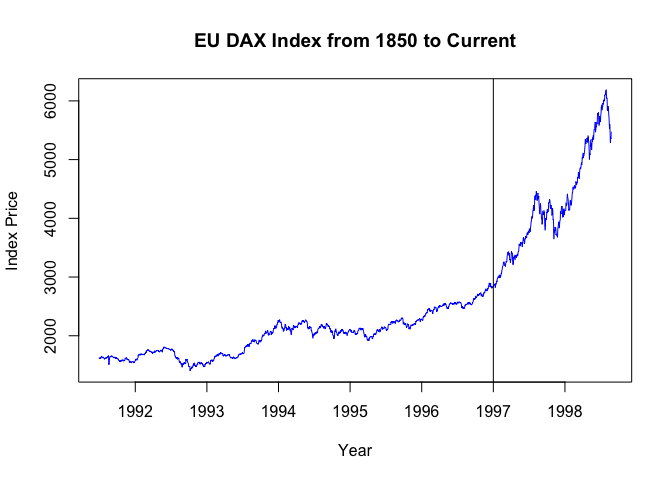
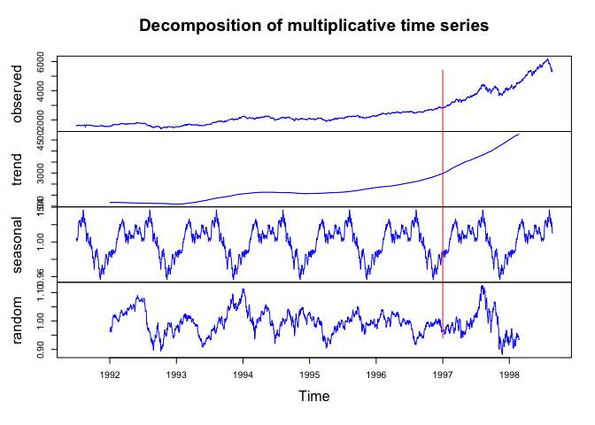
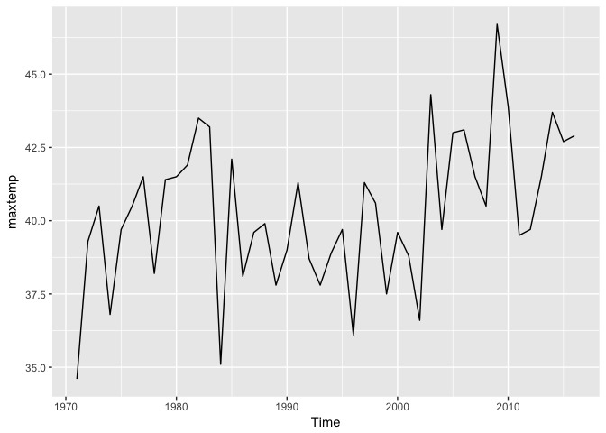
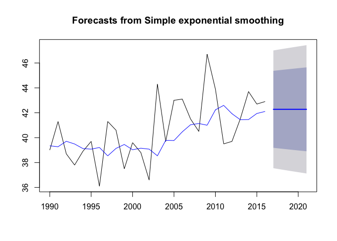
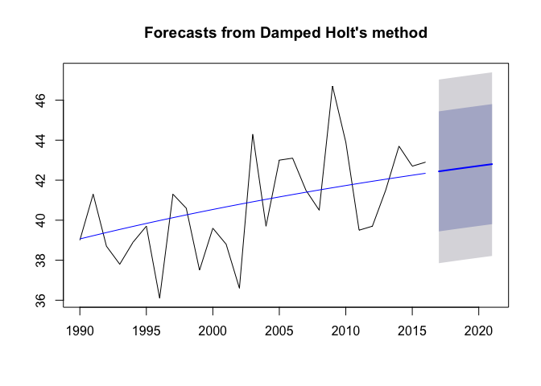

#### Question 1: Brief Financial Data
##### a) Attain DAX Index

```r
daxIndex <- EuStockMarkets[,"DAX"]
str(daxIndex)
```

```
##  Time-Series [1:1860] from 1991 to 1999: 1629 1614 1607 1621 1618 ...
```

##### b) Plot the Dax Index

```r
plot(
    daxIndex,
    main="EU DAX Index from 1850 to Current",
    xlab="Year",
    ylab="Index Price",
    col="blue"
)
abline(
    v=1997,
    color="red"
)
```

```
## Warning in int_abline(a = a, b = b, h = h, v = v, untf = untf, ...):
## "color" is not a graphical parameter
```

<!-- -->

##### c) Decomposed DAX Index

```r
daxIndex.decompose.multi <- decompose(daxIndex,type="multiplicative")
plot(daxIndex.decompose.multi,col="blue")
abline(
    v=1997,
    col="red"
)
```

<!-- -->

#### Question 2: Temperature Data
##### a) Attain maxtemp data set

```r
autoplot(maxtemp)
```

<!-- -->

##### b) Get temps from 1990 to current

```r
temps <- window(maxtemp, start = 1990)
```

##### c) Predict next 5 years

```r
temps.ses <- ses(
    temps, 
    h=5
)
plot(temps.ses)
lines(
    temps.ses$fitted,
    col="blue"
)
```

<!-- -->

```r
temps.ses$model$aicc
```

```
## [1] 141.5302
```

##### d) Holt's Linear Trend

```r
temps.holt <- holt(
    temps, 
    h=5, 
    damped = TRUE, 
    inital = "optimal"
)
plot(temps.holt)
lines(
    temps.holt$fitted,
    col="blue"
)
```

<!-- -->

```r
temps.holt$model$aicc
```

```
## [1] 145.5865
```

##### e) Compare AICc

```r
temps.ses$model$aicc
```

```
## [1] 141.5302
```

```r
temps.holt$model$aicc
```

```
## [1] 145.5865
```
The model with the best fit is SES.

#### Question 3: The Wands Choose the Wizard
##### a) Load Data

```r
gregorovitch <- read.csv("Unit11TimeSeries_Gregorovitch.csv")
ollivander <- read.csv("Unit11TimeSeries_Ollivander.csv")

names(gregorovitch) <- c("year","wands_sold")
names(ollivander) <- c("year","wands_sold")

str(gregorovitch)
```

```
## 'data.frame':	47 obs. of  2 variables:
##  $ year      : Factor w/ 47 levels "1/1/1971","1/1/1972",..: 1 2 3 4 5 6 7 8 9 10 ...
##  $ wands_sold: int  1295 1349 1298 1493 1432 1431 1291 1247 1403 1188 ...
```

```r
str(ollivander)
```

```
## 'data.frame':	47 obs. of  2 variables:
##  $ year      : Factor w/ 47 levels "1/1/1971","1/1/1972",..: 1 2 3 4 5 6 7 8 9 10 ...
##  $ wands_sold: int  1304 1168 1252 1296 1458 1443 1282 1450 1338 1063 ...
```

##### b) Format Date

```r
gregorovitch$year <- as.Date(gregorovitch$year, "%m/%d/%Y")
ollivander$year <- as.Date(gregorovitch$year, "%m/%d/%Y")

str(gregorovitch)
```

```
## 'data.frame':	47 obs. of  2 variables:
##  $ year      : Date, format: "1971-01-01" "1972-01-01" ...
##  $ wands_sold: int  1295 1349 1298 1493 1432 1431 1291 1247 1403 1188 ...
```

```r
str(ollivander)
```

```
## 'data.frame':	47 obs. of  2 variables:
##  $ year      : Date, format: "1971-01-01" "1972-01-01" ...
##  $ wands_sold: int  1304 1168 1252 1296 1458 1443 1282 1450 1338 1063 ...
```

##### c) Load data into time series

```r
gregorovitch.ts <- xts(gregorovitch$wands_sold, order.by=gregorovitch$year)
ollivander.ts <- xts(ollivander$wands_sold, order.by=ollivander$year)
str(gregorovitch.ts)
```

```
## An 'xts' object on 1971-01-01/2017-01-01 containing:
##   Data: int [1:47, 1] 1295 1349 1298 1493 1432 1431 1291 1247 1403 1188 ...
##   Indexed by objects of class: [Date] TZ: UTC
##   xts Attributes:  
##  NULL
```

```r
str(ollivander.ts)
```

```
## An 'xts' object on 1971-01-01/2017-01-01 containing:
##   Data: int [1:47, 1] 1304 1168 1252 1296 1458 1443 1282 1450 1338 1063 ...
##   Indexed by objects of class: [Date] TZ: UTC
##   xts Attributes:  
##  NULL
```

##### d) Create a dyGraph

```r
wandsSold <- merge(gregorovitch.ts,ollivander.ts)

dygraph(wandsSold,main="Olivander vs. Gregorovitch Wand Sales",xlab="Year",ylab="Sales") %>%
    dySeries("ollivander.ts", label="Ollivander", col="red") %>%
    dySeries("gregorovitch.ts", label="Gregorovitch",col="green") %>%
    dyRangeSelector() %>%
    dyShading(from="1995-01-01",to="1999-01-01") %>%
    dyHighlight(highlightSeriesOpts = list( strokeWidth = 3 ) )
```

<!--html_preserve--><div id="htmlwidget-406b69f9f86296a6ecac" style="width:672px;height:480px;" class="dygraphs html-widget"></div>
<script type="application/json" data-for="htmlwidget-406b69f9f86296a6ecac">{"x":{"attrs":{"title":"Olivander vs. Gregorovitch Wand Sales","xlabel":"Year","ylabel":"Sales","labels":["year","Ollivander","Gregorovitch"],"legend":"auto","retainDateWindow":false,"axes":{"x":{"pixelsPerLabel":60}},"colors":["red","green"],"series":{"Ollivander":{"axis":"y"},"Gregorovitch":{"axis":"y"}},"showRangeSelector":true,"rangeSelectorHeight":40,"rangeSelectorPlotFillColor":" #A7B1C4","rangeSelectorPlotStrokeColor":"#808FAB","interactionModel":"Dygraph.Interaction.defaultModel","highlightCircleSize":3,"highlightSeriesBackgroundAlpha":0.5,"highlightSeriesOpts":{"strokeWidth":3},"hideOverlayOnMouseOut":true},"scale":"yearly","annotations":[],"shadings":[{"from":"1995-01-01T00:00:00.000Z","to":"1999-01-01T00:00:00.000Z","color":"#EFEFEF","axis":"x"}],"events":[],"format":"date","data":[["1971-01-01T00:00:00.000Z","1972-01-01T00:00:00.000Z","1973-01-01T00:00:00.000Z","1974-01-01T00:00:00.000Z","1975-01-01T00:00:00.000Z","1976-01-01T00:00:00.000Z","1977-01-01T00:00:00.000Z","1978-01-01T00:00:00.000Z","1979-01-01T00:00:00.000Z","1980-01-01T00:00:00.000Z","1981-01-01T00:00:00.000Z","1982-01-01T00:00:00.000Z","1983-01-01T00:00:00.000Z","1984-01-01T00:00:00.000Z","1985-01-01T00:00:00.000Z","1986-01-01T00:00:00.000Z","1987-01-01T00:00:00.000Z","1988-01-01T00:00:00.000Z","1989-01-01T00:00:00.000Z","1990-01-01T00:00:00.000Z","1991-01-01T00:00:00.000Z","1992-01-01T00:00:00.000Z","1993-01-01T00:00:00.000Z","1994-01-01T00:00:00.000Z","1995-01-01T00:00:00.000Z","1996-01-01T00:00:00.000Z","1997-01-01T00:00:00.000Z","1998-01-01T00:00:00.000Z","1999-01-01T00:00:00.000Z","2000-01-01T00:00:00.000Z","2001-01-01T00:00:00.000Z","2002-01-01T00:00:00.000Z","2003-01-01T00:00:00.000Z","2004-01-01T00:00:00.000Z","2005-01-01T00:00:00.000Z","2006-01-01T00:00:00.000Z","2007-01-01T00:00:00.000Z","2008-01-01T00:00:00.000Z","2009-01-01T00:00:00.000Z","2010-01-01T00:00:00.000Z","2011-01-01T00:00:00.000Z","2012-01-01T00:00:00.000Z","2013-01-01T00:00:00.000Z","2014-01-01T00:00:00.000Z","2015-01-01T00:00:00.000Z","2016-01-01T00:00:00.000Z","2017-01-01T00:00:00.000Z"],[1304,1168,1252,1296,1458,1443,1282,1450,1338,1063,1230,1237,1291,1211,1442,1649,1629,1260,1283,1617,1284,1399,1272,1297,1666,1797,1620,450,200,1308,1277,1444,1070,1031,1405,1487,1229,1493,1317,1520,1337,1547,1632,1336,1289,1439,1226],[1295,1349,1298,1493,1432,1431,1291,1247,1403,1188,1555,1512,1552,1023,1190,1197,1120,1119,1319,1692,1452,1494,1346,1519,1580,1623,1863,0,845,858,814,869,864,942,837,838,671,425,634,618,404,758,410,510,103,49,70]]},"evals":["attrs.interactionModel"],"jsHooks":[]}</script><!--/html_preserve-->
