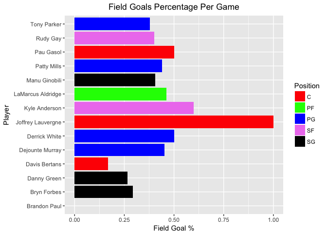

### Quesiton 1 Harry Potter Cast (50%)

#### a) IMDB Data
* Import Cast of Harry Potter and the Deathly Hallows: Part 2
    * https://www.imdb.com/title/tt1201607/fullcredits?ref_=tt_ql_1
#### b) R Code to read HTML Document

```r
# Get the HTML from IMDB
response <- GET("https://www.imdb.com/title/tt1201607/fullcredits?ref_=tt_ql_1")
response <- htmlParse(response)

# Get Cast List Table
qry_xpath <- "//table[@class='cast_list']/tr/td[@itemprop='actor'] | //table[@class='cast_list']/tr/td[@class='character']"
raw_cast <- xpathSApply( response, qry_xpath, xmlValue)

# Convert to Data Frame
# Actors on Odd Rows & Character are on Even Rows
total_rows <- length(raw_cast)
even_indexes <- seq(2, total_rows, 2)
odd_indexes <- seq(1, total_rows - 1, 2)
cast <- data.frame(
    actor = raw_cast[odd_indexes],
    character = raw_cast[even_indexes],
    stringsAsFactors = FALSE 
)
head(cast)
```

```
##                             actor
## 1    \n Ralph Fiennes\n          
## 2   \n Michael Gambon\n          
## 3     \n Alan Rickman\n          
## 4 \n Daniel Radcliffe\n          
## 5     \n Rupert Grint\n          
## 6      \n Emma Watson\n          
##                                                                   character
## 1             \n            Lord Voldemort \n                  \n          
## 2 \n            Professor Albus Dumbledore \n                  \n          
## 3    \n            Professor Severus Snape \n                  \n          
## 4               \n            Harry Potter \n                  \n          
## 5                \n            Ron Weasley \n                  \n          
## 6           \n            Hermione Granger \n                  \n
```

#### c) Clean up table

```r
# Clean Up Data
# Remove Leading & trailing White Spaces
cast <- sapply( cast, trimws, which="both" )

# Remove "\n "
cast <- gsub( "\n ", "", cast)

#Update Mr. Warwick character
cast[grep( "^Warwick", cast[,1] ),2] <- "Griphook  /  Professor  Filius  Flitwick"

head(cast)
```

```
##      actor              character                   
## [1,] "Ralph Fiennes"    "Lord Voldemort"            
## [2,] "Michael Gambon"   "Professor Albus Dumbledore"
## [3,] "Alan Rickman"     "Professor Severus Snape"   
## [4,] "Daniel Radcliffe" "Harry Potter"              
## [5,] "Rupert Grint"     "Ron Weasley"               
## [6,] "Emma Watson"      "Hermione Granger"
```

```r
tail(cast)
```

```
##        actor               character                               
## [144,] "Nick Turner"       "Death Eater    (uncredited)"           
## [145,] "Aaron Virdee"      "Gryffindor Senior    (uncredited)"     
## [146,] "John Warman"       "Railway Station Porter    (uncredited)"
## [147,] "Spencer Wilding"   "Knight of Hogwarts    (uncredited)"    
## [148,] "Amy Wiles"         "Slytherin Student    (uncredited)"     
## [149,] "Thomas Williamson" "Hogwarts Student    (uncredited)"
```

```r
summary(cast)
```

```
##             actor                                character  
##  Aaron Virdee  :  1   Gringotts Goblin    (uncredited): 10  
##  Adrian Rawlins:  1   Death Eater                     :  9  
##  Afshan Azad   :  1   Death Eater    (uncredited)     :  6  
##  Alan Rickman  :  1   Wizard Parent    (uncredited)   :  5  
##  Albert Tang   :  1   Hogwarts Student    (uncredited):  4  
##  Alfie McIlwain:  1   Giant                           :  3  
##  (Other)       :143   (Other)                         :112
```

#### d) Split Actor's Name

```r
# set vectors for First Name and Last Name to temporarly store names
firstName <- character(0)
lastName <- character(0)
for( i in 1:nrow(cast) ) {
    #split name
    actors <- strsplit(cast[i,1], " ")
    
    if( length(actors$actor) == 2 ){
        # If name is only 2 words, store data
        firstName[i] <- actors$actor[1]
        lastName[i] <- actors$actor[2]
    } else {
        # If name is > 2 words, store only the last word in lastName vector
        firstName[i] <- paste(actors$actor[1:length(actors$actor)-1],collapse = " ")
        lastName[i] <- actors$actor[length(actors$actor)]
    }
}

# Combine Vectors with existing Data Frame
cast <- data.frame( FirstName = firstName, LastName = lastName, Character = cast[,2])
```

#### e) Present first 10 rows

```r
kable( head( cast, 10 ), row.names=FALSE )  %>%
  kable_styling(bootstrap_options = c("striped", "condensed"), full_width = F)
```

<table class="table table-striped table-condensed" style="width: auto !important; margin-left: auto; margin-right: auto;">
 <thead>
  <tr>
   <th style="text-align:left;"> FirstName </th>
   <th style="text-align:left;"> LastName </th>
   <th style="text-align:left;"> Character </th>
  </tr>
 </thead>
<tbody>
  <tr>
   <td style="text-align:left;"> Ralph </td>
   <td style="text-align:left;"> Fiennes </td>
   <td style="text-align:left;"> Lord Voldemort </td>
  </tr>
  <tr>
   <td style="text-align:left;"> Michael </td>
   <td style="text-align:left;"> Gambon </td>
   <td style="text-align:left;"> Professor Albus Dumbledore </td>
  </tr>
  <tr>
   <td style="text-align:left;"> Alan </td>
   <td style="text-align:left;"> Rickman </td>
   <td style="text-align:left;"> Professor Severus Snape </td>
  </tr>
  <tr>
   <td style="text-align:left;"> Daniel </td>
   <td style="text-align:left;"> Radcliffe </td>
   <td style="text-align:left;"> Harry Potter </td>
  </tr>
  <tr>
   <td style="text-align:left;"> Rupert </td>
   <td style="text-align:left;"> Grint </td>
   <td style="text-align:left;"> Ron Weasley </td>
  </tr>
  <tr>
   <td style="text-align:left;"> Emma </td>
   <td style="text-align:left;"> Watson </td>
   <td style="text-align:left;"> Hermione Granger </td>
  </tr>
  <tr>
   <td style="text-align:left;"> Evanna </td>
   <td style="text-align:left;"> Lynch </td>
   <td style="text-align:left;"> Luna Lovegood </td>
  </tr>
  <tr>
   <td style="text-align:left;"> Domhnall </td>
   <td style="text-align:left;"> Gleeson </td>
   <td style="text-align:left;"> Bill Weasley </td>
  </tr>
  <tr>
   <td style="text-align:left;"> Clémence </td>
   <td style="text-align:left;"> Poésy </td>
   <td style="text-align:left;"> Fleur Delacour </td>
  </tr>
  <tr>
   <td style="text-align:left;"> Warwick </td>
   <td style="text-align:left;"> Davis </td>
   <td style="text-align:left;"> Griphook  /  Professor  Filius  Flitwick </td>
  </tr>
</tbody>
</table>

### Question 2 SportsBall (50%)
#### a) ESPN Data
* Import Shooting Statistics of the San Antonio Spurs
    * http://www.espn.com/nba/team/stats/_/name/sa/san-antonio-spurs
#### b) R Code to read HTML Document

```r
# Get the HTML from ESPN
response <- GET("http://www.espn.com/nba/team/stats/_/name/sa/san-antonio-spurs")
response <- htmlParse(response)

# Get Second Table labeled class=tablehead from webpage document
qry_xpath <- "(//table[@class='tablehead'])[2]/tr[contains(@class, 'oddrow player')]/td | (//table[@class='tablehead'])[2]/tr[contains(@class, 'evenrow player')]/td"
result <- xpathSApply(response, qry_xpath, xmlValue)
stats <- data.frame( matrix(result, nrow=14, ncol =15, byrow = TRUE), stringsAsFactors=FALSE )

# Get Column Names
qry_xpath <- "(//table[@class='tablehead'])[2]/tr[@class='colhead']/td"
result <- xpathSApply(response, qry_xpath, xmlValue)
names(stats) <- make.names(result)
head(stats)
```

```
##                  PLAYER FGM  FGA  FG. X3PM X3PA X3P. FTM FTA  FT. X2PM
## 1 LaMarcus Aldridge, PF 7.4 16.0 .463  0.6  1.0 .600 8.2 8.4 0.98  6.8
## 2       Patty Mills, PG 5.0 11.4 .439  2.6  7.0 .371 0.8 1.0 0.80  2.4
## 3          Rudy Gay, SF 5.2 13.0 .400  0.8  3.6 .222 1.0 1.8 0.56  4.4
## 4     Manu Ginobili, SG 3.0  7.4 .405  1.2  3.6 .333 1.8 2.2 0.82  1.8
## 5   Dejounte Murray, PG 2.8  6.2 .452  0.8  1.2 .667 1.4 1.8 0.78  2.0
## 6       Tony Parker, PG 2.8  7.4 .378  0.0  1.0 .000 1.0 1.4 0.71  2.8
##   X2PA X2P.   PPS AFG.
## 1 15.0 .453 1.475 0.48
## 2  4.4 .545 1.175 0.55
## 3  9.4 .468  .938 0.43
## 4  3.8 .474 1.216 0.49
## 5  5.0 .400 1.258 0.52
## 6  6.4 .438  .892 0.38
```

#### c) Clean the data

```r
# Update stat fields to numeric
stats <- transform( 
    stats,
    FGM = as.numeric(FGM),
    FGA = as.numeric(FGA),
    FG. = as.numeric(FG.),
    X3PM = as.numeric(X3PM),
    X3PA = as.numeric(X3PA),
    X3P. = as.numeric(X3P.),
    FTM = as.numeric(FTM),
    FTA = as.numeric(FTA),
    FT. = as.numeric(FT.),
    X2PM = as.numeric(X2PM),
    X2PA = as.numeric(X2PA),
    X2P. = as.numeric(X2P.),
    PPS = as.numeric(PPS),
    AFG. = as.numeric(AFG.)
)

# set vectors for First Name and Last Name to temporarly store names
players <- data.frame( 
    do.call( 'rbind', strsplit( as.character( test_stats$PLAYER ),", ",fixed=TRUE))
)
names(players) <- c('Player', 'Position')
stats$PLAYER <- players$Player
stats$Position <- players$Position
str(stats)
```

```
## 'data.frame':	14 obs. of  16 variables:
##  $ PLAYER  : Factor w/ 14 levels "Brandon Paul",..: 9 11 13 10 5 14 12 8 2 3 ...
##  $ FGM     : num  7.4 5 5.2 3 2.8 2.8 2 2.4 1.3 1.6 ...
##  $ FGA     : num  16 11.4 13 7.4 6.2 7.4 4 4 4.3 6 ...
##  $ FG.     : num  0.463 0.439 0.4 0.405 0.452 0.378 0.5 0.6 0.294 0.267 ...
##  $ X3PM    : num  0.6 2.6 0.8 1.2 0.8 0 0.2 0 0.5 1 ...
##  $ X3PA    : num  1 7 3.6 3.6 1.2 1 0.6 0.8 2.3 4 ...
##  $ X3P.    : num  0.6 0.371 0.222 0.333 0.667 0 0.333 0 0.222 0.25 ...
##  $ FTM     : num  8.2 0.8 1 1.8 1.4 1 1.8 0.6 1.3 0 ...
##  $ FTA     : num  8.4 1 1.8 2.2 1.8 1.4 2 0.8 1.8 0 ...
##  $ FT.     : num  0.98 0.8 0.56 0.82 0.78 0.71 0.9 0.75 0.71 0 ...
##  $ X2PM    : num  6.8 2.4 4.4 1.8 2 2.8 1.8 2.4 0.8 0.6 ...
##  $ X2PA    : num  15 4.4 9.4 3.8 5 6.4 3.4 3.2 2 2 ...
##  $ X2P.    : num  0.453 0.545 0.468 0.474 0.4 0.438 0.529 0.75 0.375 0.3 ...
##  $ PPS     : num  1.475 1.175 0.938 1.216 1.258 ...
##  $ AFG.    : num  0.48 0.55 0.43 0.49 0.52 0.38 0.53 0.6 0.35 0.35 ...
##  $ Position: Factor w/ 5 levels "C","PF","PG",..: 2 3 4 5 3 3 1 4 5 5 ...
```

#### d) Bar Chart

```r
Palette1 <- c('red','green','blue','violet','black')
ggplot( stats , aes( PLAYER, FG., fill=Position ) ) +
    geom_bar(stat="identity") +
    scale_fill_manual(values=Palette1) +
    labs(title="Field Goals Percentage Per Game",x ="Player", y = "Field Goal %" ) +
    coord_flip() +
    theme(plot.title = element_text(hjust = 0.5))
```

<!-- -->
